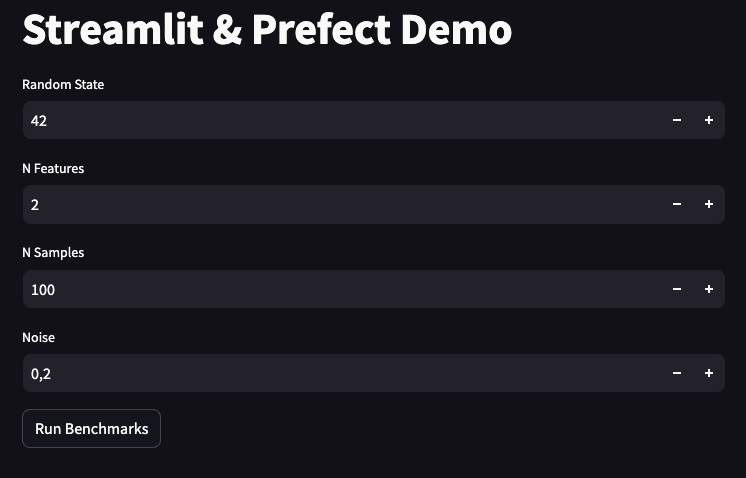

## Integrating nnbench with Streamlit and Prefect

In a project you may want to execute benchmarks or investigate their results with a dedicated frontend. There exist several frameworks that can help you setting up a frontend quickly. For example [Streamlit](https://streamlit.io/), [Gradio](https://www.gradio.app/), [Dash](https://dash.plotly.com/tutorial), or you could roll your own implementation using a backend framework such as [Flask](https://flask.palletsprojects.com/en/3.0.x/).
In this guide we will use Streamlit and integrate it with the [orchestration setup](prefect.md) we've developed with Prefect.
That guide is a prerequisite for this one. 
The full example code can be found in the nnbench [repository](https://github.com/aai-institute/nnbench/tree/main/examples/streamlit).

## The Streamlit UI
The Streamlit UI is launched by executing 
```bash
streamlit run streamlit_example.py
```
and initially looks like this:


The user interface is assembled in the final part of `streamlit_example.py`.

```python
--8<-- "examples/streamlit/streamlit.py:55:69"
```

The user inputs are generated via the custom `setup_ui()` function which then processes the input values once the "Run Benchmark" button is clicked.

```python
--8<-- "examples/streamlit/streamlit.py:23:31"
```

We use a session state to keep track of all the benchmarks we ran in the current session which then are displayed within expander elements at the bottom.

```python
--8<-- "examples/streamlit/streamlit.py:19:20"
```

## Integrating Prefect with Streamlit
To integrate Streamlit with Prefect, we have to do some initial housekeeping. Namely, we specify the URL for the `PreFectClient` as well as the storage location of run artifacts where we retrieve the benchmark results from.

```python
--8<-- "examples/streamlit/streamlit.py:15:17"
```

In this example there is no direct integration of Streamlit with nnbench, but all interactions are passing through Prefect to make use of its orchestration benefits such as caching of tasks.
Another thing to note is that we are working with local instances for easier reproducibility of this example. Adapting it to work with a remote orchestration server and object storage should be straightforward.

The main interaction of the Streamlit frontend with Prefect takes place in the `run_bms` and `get_bm_artifacts` functions.

The former searches for a Prefect deployment `"train-and-benchmark/benchmark-runner"` and executes it with the benchmark parameters specified by the user. It returns the `storage_key`, which we use to retrieve the persisted benchmark results.

```python
--8<-- "examples/streamlit/streamlit.py:34:38"
```

The `get_bm_artifacts` function gets a storage key and retrieves the corresponding results. As the results are stored in raw bytes, we have some logic to reconstruct the `nnbench.types.BenchmarkRecord` object. We transform the data into Pandas `DataFrame`s, which are later processed by Streamlit to display the results in tables.

```python
--8<-- "examples/streamlit/streamlit.py:41:52"
```

## Running the example
To run the example, we have to do several things. 
First, we need to start Prefect using `prefect server start` in the command line. 
Next, we need to make the `"train-and-benchmark/benchmark-runner"` deployment available.
We do so by running the corresponding Python file, `python runner.py`. You find that file in the `examples/prefect/src` directory. 
If you are recreating this example on your machine, make sure you have the full contents of the `prefect` directory available in addition to the `streamlit_example.py`. For more information, you can look into the [Prefect Guide](prefect.md).

Now that Prefect is set up, you can launch a local instance of Streamlit with `streamlit run streamlit_example.py`.

For more information on how to work with Streamlit, visit their [docs](https://docs.streamlit.io/).
